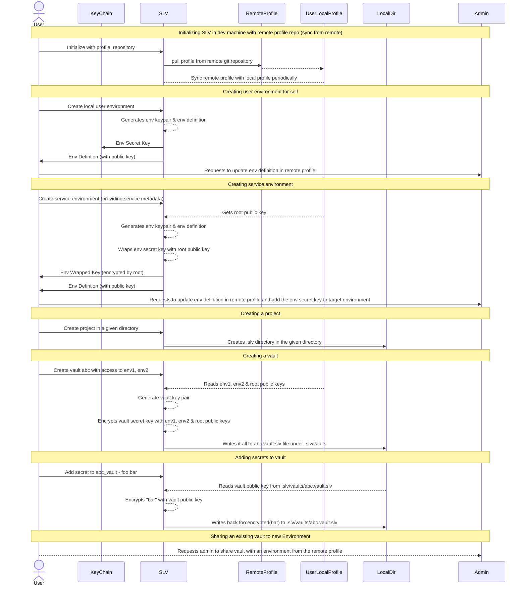
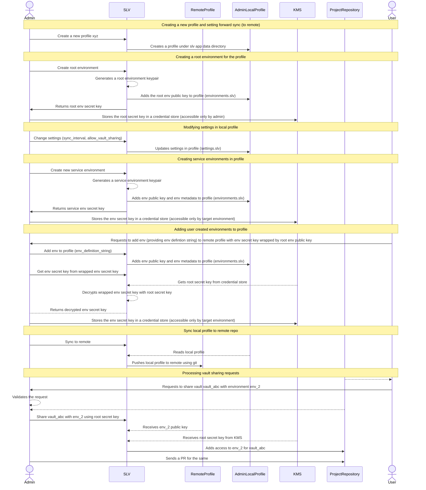
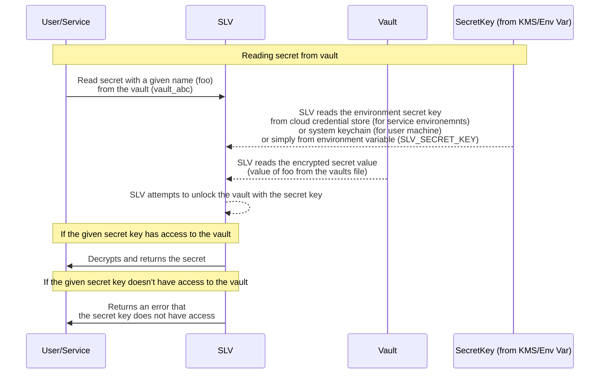

## SLV Workflow

### User Flow

**Initializing SLV in dev machine with remote profile repository**
 - User initializes SLV by providing a remote profile repository
 - SLV pulls the profile from remote repository and stores it locally under slv app data directory
 - SLV is set to sync from remote profile on a periodic basis

**Creating user environment for the current user**
 - User invokes SLV to register current dev machine as a user environment by providing information about the current user
 - SLV generates a new environment key pair
 - Stores the environment secret key in the OS credential store (such as keychain)
 - Serialises the environment metadata (along with the public key) as Serialised Environment Definition string and returns to the user
 - User shares the serialised environment definition string with the admin and requests to add it to the remote profile

**Creating/Initializing a Project**
 - User invokes SLV to initialize a specific directory as a project directory
 - SLV creates a .slv directory in the specified directory, thereby marking it as a SLV project

**Creating a Vault**
 - User invokes SLV to create a vault by specifying environments to share it with along with the name of the vault (if it is project bound) or path to the vault file.
 - SLV gets the specified environment public keys and root public key from profile
 - SLV generates a new vault key pair and encrypts the vault private key with the specified environment public keys and root public key
 - SLV then creates a vault file with extension `<vault_name>.vault.slv` and writes the vault public key and the vault private key wrappings.

**Adding Secrets to Vault**
 - User invokes SLV to add a secret (as key:value) to the vault. (Need to specify vault name or vault file path)
 - SLV reads the vault public key from the vault file `<vault_name>.vault.slv`
 - SLV encrypts the value of the secret using the vault public key and writes the encrypted secret (key:encrypted(value)) to the same vault file

**Sharing an existing Vault with another environment**
 - User requests the admin to share an existing vault to an environment by specifying the environment information

**Sequence Diagram**

### Admin Flow

**Creating a new profile and setting it to sync to remote (forward sync)**
 - Admin invokes slv to create a new profile
 - Admin inputs the profile name (example_profile) and remote repo (for forward sync)
 - SLV creates a new profile directory (example_profile) and sets the given repository as a remote sync repo

**Creating a root environment in the profile**
 - Admin invokes SLV to create a root environment for the profile
 - SLV creates a root key pair and writes the root public key to the profile into environments.slv file under the profile directory (example_profile)
 - SLV also returns the root secret key back to the admin
 - Admin stores the root secret key in a credential store (such as KMS/secret manager) accessible only by the admin

**Modifying settings in a profile**
 - Admin invokes slv to update settings such as sync_interval, allow_vault_sharing
 - SLV writes the settings to the profile into settings.slv file under the profile directory (example_profile)

**Creating service environments in profile**
 - Admin invokes SLV to create a service environment by specifying the metadata for the service such as name, email, tags
 - SLV generates a new environment keypair for the service environment
 - SLV writes the environment public key and the metadata to the profile into environments.slv file
 - SLV returns the created environment's secret key back to admin
 - Admin writes the environment secret key into the credential store that will be accessible only by the target service

**Adding user created environments to profile**
 - Admin receives request from user to add an environment to remote profile. The user sends the serialised environment definition string and the wrapped environemnt secret key (encrypted by root) along with the request.
 - Admin reviews the request and invokes slv to add the environment to profile.
 - SLV writes the environment public key and the metadata to the profile into environments.slv file
 - Admin invokes SLV to decrypt the wrapped environment secret key
 - SLV reads the root secret key and uses it to decrypt the wrapped environment secret key and returns the decrypted secret key to admin
 - Admin writes the decrypted environment secret key into the credential store that will be accessible only by the target service

**Sync local profile to remote**
 - Admin invokes SLV to sync the profile to a remote repository
 - SLV reads the profile and performs a git commit & push action by updating the changes in the local profile to remote thereby keeping it in sync

**Sharing existing vaults to environments upon request**
 - User requests admin to share a vault (vault_abc) in a given repo to an environment (env_2)
 - Admin validates the request for necessary approval and invokes SLV to share vault_abc with env_2 using root secret key
 - SLV receives root secret key from the credential store that is accessible only by the admin
 - SLV also reads the env_2 metadata and gets the env_2 public key
 - SLV then adds access to env_2 for vault_abc by decrypting the vault secret key with root secret key and re-encrypting it with env_2 public key and writing it as an additional entry in the vault file
 - One it is done, admin sends a PR for the same in the specified repo that has the vault file

**Sequence Diagram**

### Reading Secrets

**Reading secrets from vault**
 - Service reads the secret from vault by specifying the secret name (foo) and the vault name (vault_abc)
 - SLV reads the environment secret key from cloud credential store (for service environemnts) or system keychain (for user machine) or simply from environment variable (SLV_SECRET_KEY)
 - SLV reads the encrypted secret value (value of foo from the vaults file)
 - SLV attempts to unlock the vault with the secret key
 - If the given secret key has access to the vault, SLV decrypts and returns the secret
 - If the given secret key doesn't have access to the vault, SLV returns an error

**Sequence Diagram**
